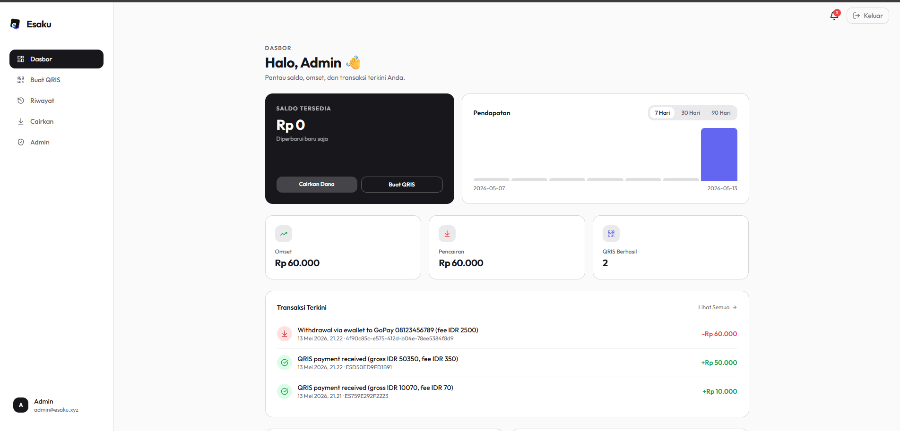

# Esaku (React + Express)

Esaku is a fully-functional QRIS Payment Gateway dashboard tailored for individuals (merchant perorangan) in Indonesia. 

> **Important**: This project has been migrated from vanilla HTML/JS to a modern **React + Vite** frontend, styled with **Tailwind CSS**. The backend remains an **Express.js** server.



## Features

- **React Single Page Application**: Fast, seamless navigation using React Router.
- **Tailwind CSS Styling**: Modern, responsive, and minimalist UI with dark mode support.
- **MDR 0.7% Flat**: Automatically calculates standard MDR to be paid by the buyer.
- **No KYC Required**: Direct generation of QRIS without complex verifications.
- **Dynamic Dashboard**: Live balance, revenue charts (7/30/90 days), and transaction history.
- **Live QRIS Generator**: Generate QRIS dynamically with real-time countdown and payment polling.
- **Withdrawals**: Built-in logic for Bank Transfer & E-Wallet withdrawals with fee deduction.
- **Admin CMS**: Fully functional admin panel to monitor stats, user balances, manage withdrawal queues, and change app settings.

## Tech Stack

### Frontend
- **Framework**: React 18
- **Build Tool**: Vite
- **Routing**: React Router v6
- **Styling**: Tailwind CSS
- **Animations**: Framer Motion
- **Icons**: Lucide React

### Backend
- **Server**: Node.js + Express
- **Database**: SQLite (via `better-sqlite3`)
- **Authentication**: JWT & Hostinger OAuth
- **Image Handling**: Base64 data URIs for branding assets

## Getting Started

1. Clone this repository and install dependencies:

   ```bash
   npm install
   ```

2. Copy the example environment file and configure it (optional, defaults usually work for local dev):

   ```bash
   cp .env.example .env
   ```

3. Initialize the database (creates tables, default settings, and the default admin):

   ```bash
   npm run db:init
   ```

   The default admin (`admin@esaku.xyz`) is created with the password `root1234!` (as defined in `.env`). You can change this in the Admin CMS or your Profile page later.

4. Start both the Vite dev server and Express backend concurrently:

   ```bash
   npm run dev
   ```

   - **Frontend**: Runs on `http://localhost:5173`
   - **Backend API**: Runs on `http://localhost:3005` (proxied automatically via Vite)

5. (Optional) To build for production:

   ```bash
   npm run build
   npm start
   ```

   This will build the React app into the `dist` directory, which the Express server will then statically serve alongside the API routes.

## Pricing model (configurable via Admin CMS)

- QRIS: flat 0.7% per paid transaction (deducted from inflow)
- Withdrawal: minimum **IDR 50,000**
- Bank transfer fee: **IDR 6,500** (default — example: IDR 50,000 + 6,500 = IDR 56,500 debit)
- E-wallet fee: **IDR 2,500** (default — example: IDR 50,000 + 2,500 = IDR 52,500 debit)
- QRIS expiry: **15 minutes** by default; admin can change in CMS.

## Admin CMS

Login as an Admin (default `admin@esaku.xyz`) and visit `/admin` to:

1. View platform aggregate statistics (total users, balance, pending withdrawals).
2. Monitor and fulfill withdrawal requests (mark as completed or failed).
3. Configure API Provider settings (Internal, Midtrans, Xendit, etc.).
4. Adjust platform fees.
5. Manage users.

## License

MIT License.
